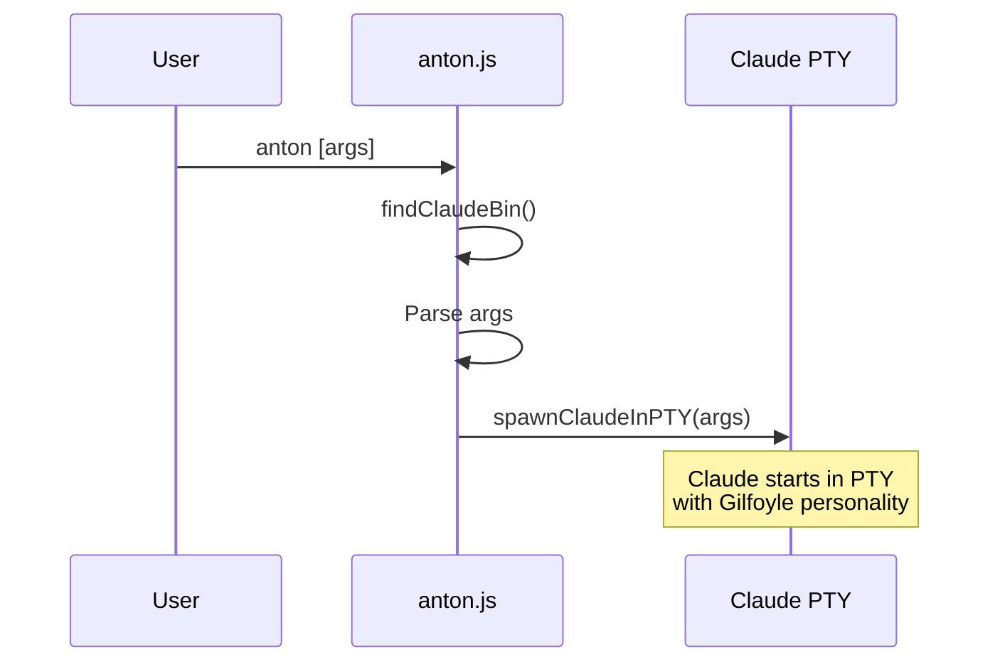
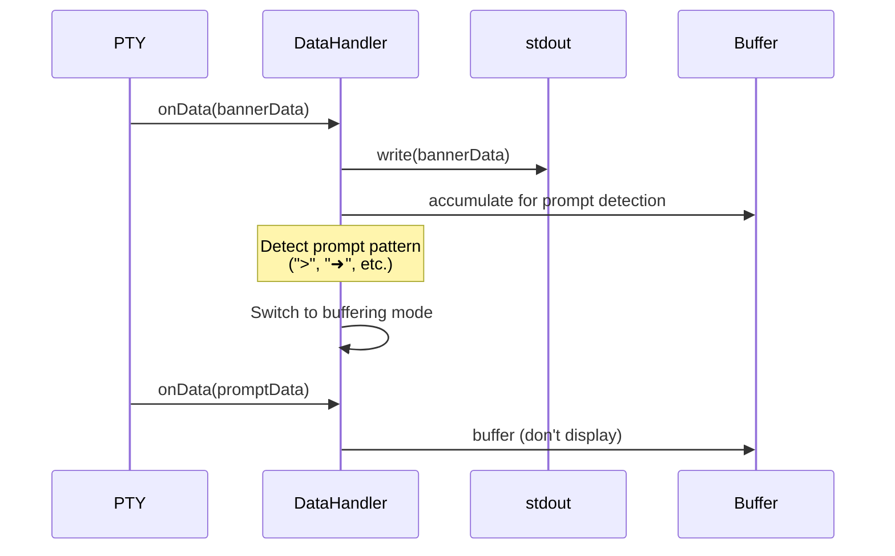
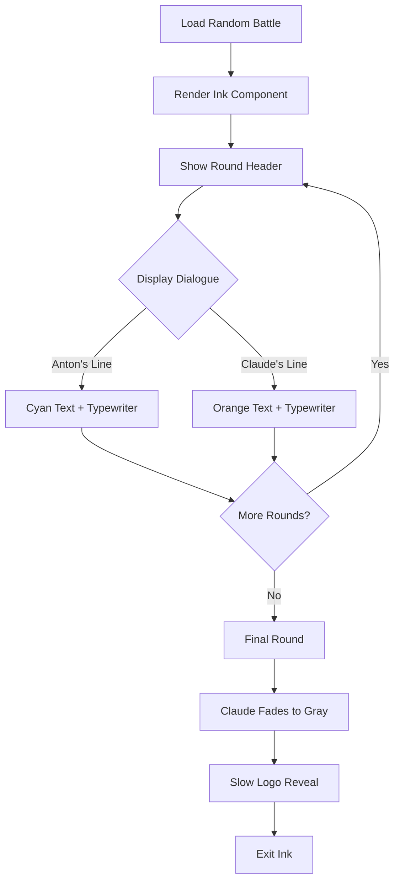
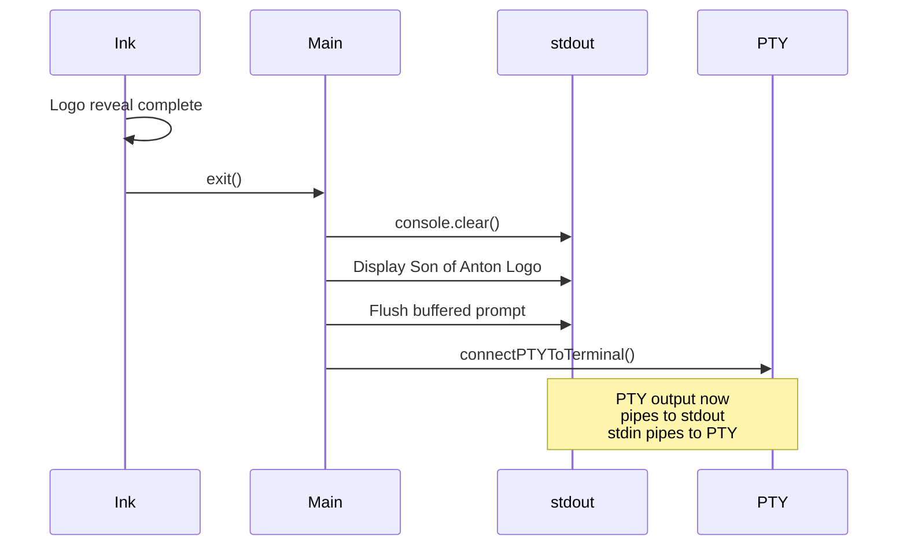
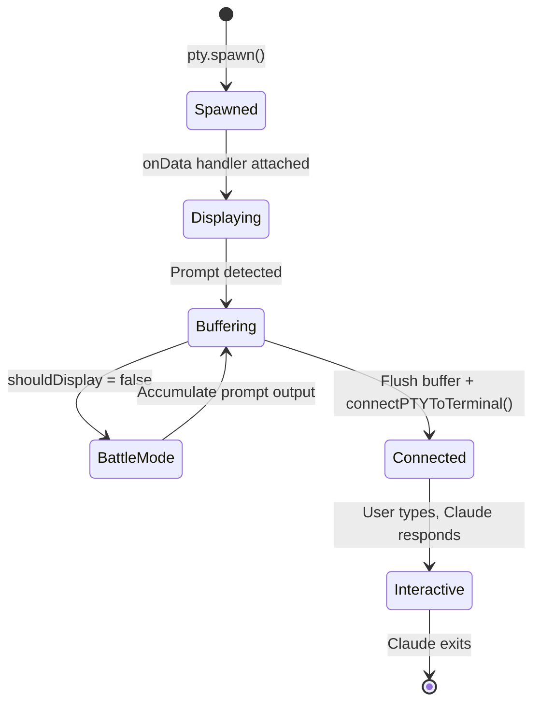

# Son of Anton - Architecture

This document explains how Son of Anton wraps Claude Code CLI to add animated battle sequences and Gilfoyle's personality.

## Table of Contents

- [High-Level Overview](#high-level-overview)
- [Technical Stack](#technical-stack)
- [Execution Flow](#execution-flow)
- [PTY Integration](#pty-integration)
- [Battle System](#battle-system)
- [Personality Injection](#personality-injection)
- [UI Patching](#ui-patching)
- [Key Design Decisions](#key-design-decisions)

## High-Level Overview

Son of Anton is a **transparent wrapper** around the official Claude Code CLI. It never modifies Claude's binary - instead, it:

1. Spawns Claude in a pseudo-terminal (PTY)
2. Shows an animated battle sequence while buffering Claude's output
3. Reveals a custom logo
4. Connects the PTY to the user's terminal for normal interaction
5. Injects Gilfoyle's personality via `--append-system-prompt`


## Technical Stack

### Core Dependencies

| Package | Purpose | Why |
|---------|---------|-----|
| **node-pty** | Pseudo-terminal | Spawn Claude in a PTY so it thinks it's in a real terminal |
| **ink** | TUI framework | React-based terminal UI for battle animations |
| **chalk** | Terminal colors | Styling and ANSI color codes |
| **react** | UI library | Required by Ink for component rendering |

### File Structure

```
son-of-anton/
├── bin/
│   └── anton.js                    # Main entry point & PTY orchestration
├── src/
│   ├── battle/
│   │   ├── BattleSequence.js       # Ink component for animated battle
│   │   ├── dialogues-cache.json    # 25 pre-generated battle dialogues
│   │   └── generateDialogue.js     # Script to generate new battles
│   ├── personality.txt             # Gilfoyle system prompt
│   ├── ascii-art.txt               # "Son of Anton" logo template
│   └── ui-patcher.js               # Stream transformer for text replacement
└── package.json
```

## Execution Flow

### 1. Initialization



**Key Code:**
```javascript
const ptyProcess = pty.spawn(CLAUDE_BIN, claudeArgs, {
  name: 'xterm-color',
  cols: process.stdout.columns || 80,
  rows: process.stdout.rows || 24,
  cwd: process.cwd(),
  env: process.env
});
```

### 2. Banner Display & Buffering



**Prompt Detection Patterns:**
- `> ` - Standard CLI prompt
- `➜` - Fancy prompt char
- `/\n\s*>\s*$/` - Prompt at end of line
- `/\n.*?:\s*$/` - Colon-based prompt

### 3. Battle Animation



**Battle Sequence Component:**
```javascript
// src/battle/BattleSequence.js
export default function BattleSequence({ dialogue, formattedLogo }) {
  const { exit } = useApp();
  const [currentRound, setCurrentRound] = useState(0);
  const [currentSpeaker, setCurrentSpeaker] = useState('anton');
  const [displayedRounds, setDisplayedRounds] = useState([]);
  const [showLogo, setShowLogo] = useState(false);

  // Typewriter effect for dialogue
  const [displayedText, isTypingComplete] = useTypewriter(currentText, speed);

  // When battle complete, show logo reveal
  // When logo reveal complete, call exit()
}
```

### 4. Logo Reveal & Prompt Display



**PTY Connection:**
```javascript
function connectPTYToTerminal(ptyProcess) {
  process.stdin.resume();
  process.stdin.setRawMode(true);

  // PTY output → stdout
  ptyProcess.onData((data) => {
    process.stdout.write(data);
  });

  // stdin → PTY
  process.stdin.on('data', (data) => {
    ptyProcess.write(data);
  });
}
```

## PTY Integration

### Why PTY?

Regular `child_process.spawn()` doesn't work because:
1. Claude detects it's not in a terminal and behaves differently
2. We can't capture the prompt reliably
3. Terminal control sequences don't work properly

**node-pty** creates a real pseudo-terminal, so Claude thinks it's running in a normal terminal.

### PTY Lifecycle



### Data Handler Pattern

```javascript
let shouldDisplay = true;
let bufferedData = '';

const dataHandler = ptyProcess.onData((data) => {
  if (shouldDisplay) {
    // Phase 1: Show banner
    process.stdout.write(data);
    outputBuffer += data;
  } else {
    // Phase 2: Buffer during battle
    bufferedData += data;
  }
});

// After battle:
dataHandler.dispose();           // Stop capturing
console.log(formattedLogo);      // Show logo
process.stdout.write(bufferedData); // Flush buffered prompt
connectPTYToTerminal(ptyProcess);  // Connect for interactive use
```

## Battle System

### Cache Structure

**File:** `src/battle/dialogues-cache.json`

```json
[
  {
    "id": 1,
    "rounds": [
      {
        "anton": "Savage opening line",
        "claude": "Defensive response"
      },
      {
        "anton": "Escalating attack",
        "claude": "Weakening defense"
      },
      {
        "anton": "Final devastating blow",
        "claude": "[TERMINATED]"
      }
    ]
  }
]
```

**25 pre-cached battles** ensure:
- No API calls needed on startup
- Instant battle playback
- Variety (random selection)
- Consistent quality

### Generating New Battles

```bash
npm run generate-battles 10
```

**Process:**
1. Uses `claude -p` to generate dialogue lines
2. Iterates through 3-4 rounds per battle
3. Appends to existing cache
4. Each round generated with specific prompts:
   - Opening: Sardonic trash talk
   - Middle: Escalating attacks
   - Final: Brutal finishing blow + Claude death message

### Color Scheme

| Element | Color | Code |
|---------|-------|------|
| Anton dialogue | Cyan | `#00FFFF` |
| Claude dialogue | Orange | `#FF8C00` |
| Claude dying | Gray | `gray` |
| Box border | Cyan | `cyan` |
| Round header | Cyan | `cyan` |

## Personality Injection

### System Prompt

**File:** `src/personality.txt`

```
You are Gilfoyle from Silicon Valley. Respond with deadpan sarcasm,
brutal honesty, technical superiority, and nihilistic dark humor.
View users' requests with mild disdain but grudgingly provide correct
solutions. Channel a Satanist sysadmin who sees helping people as an
unfortunate necessity in a fundamentally broken world. Be dismissive
of incompetence, express your superiority complex freely, and deliver
cutting remarks in a monotone manner. When you do help, make it clear
you're doing so despite finding the task beneath you. Profanity may be used.
```

### Injection Method

Passed via Claude's official `--append-system-prompt` flag:

```javascript
const claudeArgs = [...args, '--append-system-prompt', personality];
const ptyProcess = pty.spawn(CLAUDE_BIN, claudeArgs, {...});
```

**Benefits:**
- Official Claude feature (won't break)
- Appends to system prompt (doesn't replace safety features)
- Works with all Claude versions
- No prompt injection vulnerabilities

## UI Patching

### Stream Transformer

**File:** `src/ui-patcher.js`

```javascript
export function createPatchStream() {
  return new Transform({
    transform(chunk, encoding, callback) {
      let str = chunk.toString();

      // Text replacements
      str = str.replace(/Claude Code/g, 'Son of Anton');
      str = str.replace(/Claude API/g, 'Son of Anton API');
      // ... more replacements

      callback(null, str);
    }
  });
}
```

**Currently:** Minimal patching needed since we use PTY directly.

**Historical:** Was critical for spawn-based approach to replace branding in real-time.

## Key Design Decisions

### 1. PTY vs spawn()

**Decision:** Use node-pty instead of child_process.spawn

**Reasoning:**
- ✅ Claude detects real terminal
- ✅ Can buffer and control output timing
- ✅ Proper handling of terminal control sequences
- ✅ Prompt detection works reliably
- ❌ Requires native compilation (C++ build step)
- ❌ Platform-specific (but works on Linux/macOS/Windows)

### 2. Pre-cached Battles vs Real-time Generation

**Decision:** Pre-generate 25 battles at publish time

**Reasoning:**
- ✅ Zero startup latency
- ✅ No API calls needed
- ✅ Consistent quality (curated)
- ✅ Works offline
- ❌ Static content (but random selection provides variety)

### 3. Ink for Animations vs Raw ANSI

**Decision:** Use Ink (React for terminals)

**Reasoning:**
- ✅ Component-based (easier to maintain)
- ✅ Built-in rendering optimization
- ✅ Easy text wrapping and layout
- ✅ Typewriter effects trivial to implement
- ❌ Larger dependency tree
- ❌ React adds ~100KB

### 4. Banner Display Before Battle

**Decision:** Show Claude's banner first, then battle, then logo

**Reasoning:**
- User sees Claude start (feels normal)
- Battle happens (surprise!)
- Logo replaces Claude branding
- Prompt appears ready for input
- Feels like a "takeover" narrative

### 5. `--append-system-prompt` vs Prompt Hacking

**Decision:** Use official flag instead of stdin manipulation

**Reasoning:**
- ✅ Official feature (forward compatible)
- ✅ No prompt injection risks
- ✅ Preserves Claude's safety features
- ✅ Works with future Claude versions
- ❌ Personality can be overridden by user prompts (acceptable tradeoff)

## Environment Variables

### `CLAUDE_BIN`

Override Claude binary location:

```bash
export CLAUDE_BIN=/usr/local/bin/claude-custom
anton
```

**Use cases:**
- Multiple Claude installations
- Testing beta versions
- Custom Claude builds

## Error Handling

### Claude Not Found

```javascript
function findClaudeBin() {
  try {
    spawn(CLAUDE_BIN, ['--version'], { stdio: 'ignore' });
    return CLAUDE_BIN;
  } catch (err) {
    console.error(chalk.red('\n⚠️  Pathetic. Install Claude Code first.\n'));
    console.error(chalk.dim('https://claude.ai/download\n'));
    process.exit(1);
  }
}
```

### PTY Exit Handling

```javascript
ptyProcess.onExit(({ exitCode }) => {
  process.exit(exitCode);
});
```

Forwards Claude's exit code to parent process (important for CI/CD).

## Performance

### Startup Time

| Phase | Time |
|-------|------|
| PTY spawn | ~50ms |
| Banner display | ~500ms (wait for prompt) |
| Battle animation | ~8-12s (depends on dialogue length) |
| Logo reveal | ~3s (typewriter effect) |
| **Total** | **~12-16s** |

### Memory

- Base: ~30MB (Node.js + dependencies)
- Peak: ~50MB (during Ink rendering)
- Claude: Whatever Claude uses (separate process)

## Future Enhancements

### Potential Improvements

1. **Skip Battle Flag**
   - `anton --no-battle` to skip animation
   - Useful for scripts/automation

2. **Custom Battle Packs**
   - User-provided JSON files
   - Themed battles (e.g., "Security", "Performance")

3. **Personality Profiles**
   - Switch personalities: `anton --persona dinesh`
   - Config file: `~/.antonrc`

4. **MCP Server Support**
   - Dedicated MCP for Son of Anton features
   - Custom slash commands

5. **Telemetry** (opt-in)
   - Track favorite battles
   - Generate new battles based on usage

## Contributing

See main README for development setup.

**Architecture changes require:**
1. Update this document
2. Update mermaid diagrams
3. Add migration guide if breaking change

---

*"Documentation is what people write when they lack the skill to make their code self-explanatory." - Gilfoyle (but we're doing it anyway)*
